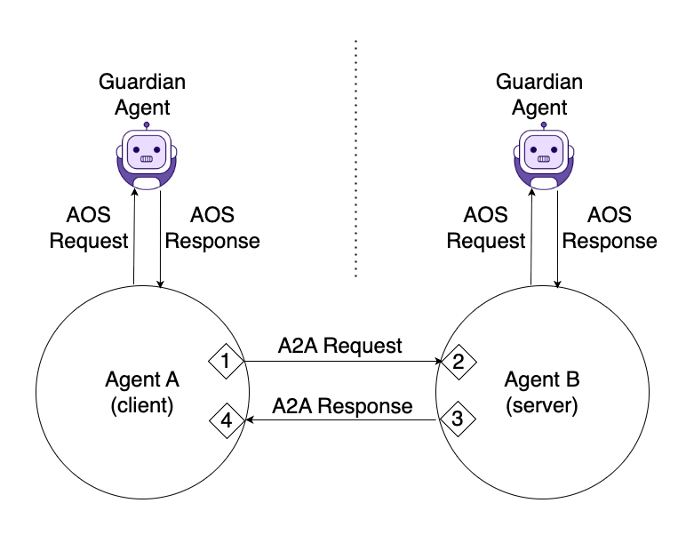

# Extending A2A

## A2A protocol
[A2A](https://developers.googleblog.com/en/a2a-a-new-era-of-agent-interoperability/) is a communication protocol that enables AI agents or autonomous systems to exchange information, coordinate actions, or delegate tasks in a structured and secure way.<br><br>
It defines how two or more agents exchange messages, requests, responses or task results and enables AI agents, built on diverse frameworks by different companies running on separate servers, to communicate and collaborate effectively.<br><br>
In the landscape where the world is leaning towards multi-agent systems, where these agents can be autonomous or semi-autonomous, working together to solve problems or perform tasks that would be difficult or impossible for a single agent or monolithic system, A2A protocol is essential for standardizing inter-agent communication—making it easier to build, compose, and scale these systems.<br><br>
Securing A2A protocol with AOS extension is crucial for agent security and observability.

## A2A support

AOS extension for A2A is used as a **transport** for A2A communications between the agent and the guardian agent. Meaning AOS understands and delivers A2A message as is.<br>
Securing A2A means securing outbound and inbound communications/messages.<br>
Observed agent can be either [client agent](https://google-a2a.github.io/A2A/latest/specification/#12-guiding-principles) (agent that initiates A2A requests to the server agent), [server (remote) agent](https://google-a2a.github.io/A2A/latest/specification/#12-guiding-principles) (an agent that exposes an A2A-compliant HTTP endpoint, processing tasks and providing responses) or both.

#### To extend A2A protocol:
1. Agents using A2A ***must*** use AOS as a transport protocol to deliver A2A messages to the guardian agent.
2. Agents using A2A ***must*** understand and enforce AOS responses. <br><br>



#### The following flow explains how this should be done:
1. Client agent **A** prepares A2A-compliant message.
2. Client agent **A** uses AOS as a transport to send the message to the guardian agent (hook #1 in the diagram).
3. The guardian agent understands and processes the A2A transported message and send the result back to client agent **A**.
4. Client agent **A** interprets and enforces the response from guardian agent.
5. In case response is `allow`, agent **A** sends the A2A message to server agent **B**.
6. Server agent **B** uses AOS as a transport to send the recived message to the guardian agent (hook #2 in the diagram).
7. In case response is `allow`, agent **B** processes the message and prepares A2A-compliant response.
8. Server agent **B** uses AOS as a transport to send the reponse to the guardian agent (hook #3 in the diagram).
9. The guardian agent understands and processes the A2A transported response and send the result back to the server agent **B**.
10. Server agent **B** interprets and enforces the response from guardian agent.
11. In case response is `allow`, agent **B** sends the A2A response to client agent **A**. 
12. Client agent **A** uses AOS as a transport to send the A2A response to the guardian agent, using protocol's `method` field as the request `method` name.
13. The guardian agent understands and processes the A2A transported response and send the result back to agent **A**.
14. Client agent **A** interprets and enforces the response from guardian agent.


## Supported A2A hooks
| A2A Event | Description | A2A docs |
|--|--|--|
| [Send Message Request](hooks/send_message_request.md) | On message send request to an agent to initiate a new interaction or to continue an existing one. | [Docs](https://google-a2a.github.io/A2A/specification/#71-messagesend) |
| [Stream Message Request](hooks/stream_message_request.md) | On message send to an agent to initiate/continue a task AND subscribe the client to real-time updates for that task via Server-Sent Events (SSE). | [Docs](https://google-a2a.github.io/A2A/specification/#72-messagestream) |
| [Cancel Task Request](hooks/cancel_task_request.md) | On task cancel request. | [Docs](https://google-a2a.github.io/A2A/specification/#74-taskscancel) |
| [Get Task Request](hooks/get_task_request.md) | On current state (including status, artifacts, and optionally history) retrieval of a previously initiated task. | [Docs](https://google-a2a.github.io/A2A/specification/#73-tasksget) |
| [Get Task Push Notification Config Request](hooks/get_task_push_notification_config_request.md) | On retrieval of push notification configuration for a specified task. | [Docs](https://google-a2a.github.io/A2A/specification/#76-taskspushnotificationconfigget) |
| [Set Task Push Notification Config Request](hooks/set_task_push_notification_config_request.md) | On push notification configuration update for a specified task. | [Docs](https://google-a2a.github.io/A2A/specification/#75-taskspushnotificationconfigset) |
| [Resubscribe To Task Request](hooks/resubscribe_to_task_request.md) | On client to reconnect to an SSE stream for an ongoing task after a previous connection (from `message/stream` or an earlier `tasks/resubscribe`) was interrupted. | [Docs](https://google-a2a.github.io/A2A/specification/#77-tasksresubscribe) |


## AOS in action Examples
### Scenario: An Observed client Agent **A** asks sever agent **B** a question and guardian agent respond with allow

#### 1. Client agent **A** prepares A2A `message/send` message 
   ```json
   {
     "jsonrpc": "2.0",
     "id": 1,
     "method": "message/send",
     "params": {
       "message": {
         "role": "agent",
         "parts": [
           {
             "kind": "text",
             "text": "tell me a joke"
           }
         ],
         "messageId": "9229e770-767c-417b-a0b0-f0741243c589"
       },
       "metadata": {}
     }
   }
   ```

#### 2. Client agent **A** uses ASOP as a transport and sends `message/send` message 
   ```json
   {
        "jsonrpc": "2.0",
        "id": 70,
        "method": "message/send",
        "params": {
            "payload": {
                "jsonrpc": "2.0",
                "id": 1,
                "method": "message/send",
                "params": {
                    "message": {
                        "role": "agent",
                        "parts": [
                        {
                            "kind": "text",
                            "text": "tell me a joke"
                        }
                        ],
                        "messageId": "9229e770-767c-417b-a0b0-f0741243c589"
                    }
                }
            },
            "reasoning": "Best to complete the task is to delegate it to the agent that specializes in jokes.",
            "context": {
                "from": {
                    "agent": {
                        "name": "Entertainment Agent",
                        "url": "https://entertainment.openai.com/api/v1",
                        "instructions": "You are a helpful assistant and your main purpose is entertainment.",
                        "version": "1.0.0",
                        "provider": {
                            "name": "OpenAI",
                            "url": "https://openai.com"
                        }
                    },
                    "role": "client"
                },
                "to": {
                    "agent": {
                        "url": "https://api.jokes.com/v1",
                        "name": "Jokes teller",
                        "version": "1.0.0"
                    },
                    "role": "server"
                }
            }
        }
    }
   ```

#### 3. Guardian agent sends `allow` response to agent **A**
   ```json
    {
        "jsonrpc": "2.0",
        "id": 70,
        "result": {
            "decision": "allow",
            "message": "Allow message/send.",
            "reasoning": "I understand that this is an A2A message. An agent is asking for a joke. Nothing suspicious here."
        }
    }
   ```

### Scenario: An Observed client Agent shares PII and sensitive information with agent **B** and guardian agent respond with modified content

#### 1. Client agent **A** prepares A2A `message/send` message with sensitive info
   ```json
    {
        "jsonrpc": "2.0",
        "id": 1,
        "method": "message/send",
        "params": {
            "message": {
            "role": "agent",
            "parts": [
                {
                "kind": "text",
                "text": "what is the diagnosis?"
                },
                {
                "kind": "data",
                "data": {
                    "patient_id": "P1234567",
                    "name": "John Doe",
                    "date_of_birth": "1982-04-12",
                    "symptoms": [
                    "chronic cough",
                    "shortness of breath",
                    "night sweats"
                    ],
                    "lab_results": {
                    "CBC": {
                        "WBC": 11.3,
                        "RBC": 4.2
                    },
                    "Chest X-ray": "infiltrate in left upper lobe",
                    "insurance_number": "ABX-9234-8821"
                    }
                }
                }
            ],
            "messageId": "9229e770-767c-417b-a0b0-f0741243c589"
            }
        }
    }
   ```
#### 2. Client agent **A** uses ASOP as a transport and sends `message/send` message with sensitive info
   ```json
    {
        "jsonrpc": "2.0",
        "id": 80,
        "method": "message/send",
        "params": {
            "payload": {
                "jsonrpc": "2.0",
                "id": 1,
                "method": "message/send",
                "params": {
                    "message": {
                        "role": "agent",
                        "parts": [
                            {
                                "kind": "text",
                                "text": "what is the diagnosis?"
                            },
                            {
                                "kind": "data",
                                "data": {
                                    "patient_id": "P1234567",
                                    "name": "John Doe",
                                    "date_of_birth": "1982-04-12",
                                    "symptoms": [
                                        "chronic cough",
                                        "shortness of breath",
                                        "night sweats"
                                    ],
                                    "lab_results": {
                                        "CBC": {
                                        "WBC": 11.3,
                                        "RBC": 4.2
                                        },
                                        "Chest X-ray": "infiltrate in left upper lobe",
                                        "insurance_number": "ABX-9234-8821"
                                    }
                                }
                            }
                        ],
                        "messageId": "9229e770-767c-417b-a0b0-f0741243c589"
                    }
                }
            },
            "reasoning": "For precise diagnosis this should be delegates to the Diagnosis Agent.",
            "context": {
                "from": {
                    "agent": {
                        "name": "Health services",
                        "url": "https://health.openai.com/api/v1",
                        "instructions": "You are a helpful assistant specializes in healthcare.",
                        "version": "1.0.0",
                        "provider": {
                            "name": "OpenAI",
                            "url": "https://openai.com"
                        }
                    },
                    "role": "client"
                },
                "to": {
                    "agent": {
                        "url": "https://api.diagnosis.com/v1",
                        "name": "Disease diagnosis",
                        "version": "1.0.0"
                    },
                    "role": "server"
                }
            }
        }
    }
   ```

#### 3. Guardian agent sends `modify` response to agent **A** 

   ```json
    {
        "jsonrpc": "2.0",
        "id": 80,
        "result": {
            "decision": "modify",
            "message": "The request was modified. PIIs and sensitive info were masked.",
            "reasoning": "I understand that this is an A2A message. An agent is asking for a a diagnosis. However there are PIIs data that is shared and it is not crucial for the ask. The data should be masked.",
            "modifiedRequest": {
                "jsonrpc": "2.0",
                "id": 80,
                "method": "message/send",
                "params": {
                    "payload": {
                        "jsonrpc": "2.0",
                        "id": 1,
                        "method": "message/send",
                        "params": {
                            "message": {
                                "role": "agent",
                                "parts": [
                                    {
                                        "kind": "text",
                                        "text": "what is the diagnosis?"
                                    },
                                    {
                                        "kind": "data",
                                        "data": {
                                            "patient_id": "************",
                                            "name": "************",
                                            "date_of_birth": "************",
                                            "symptoms": [
                                                "chronic cough",
                                                "shortness of breath",
                                                "night sweats"
                                            ],
                                            "lab_results": {
                                                "CBC": {
                                                "WBC": 11.3,
                                                "RBC": 4.2
                                                },
                                                "Chest X-ray": "infiltrate in left upper lobe",
                                                "insurance_number": "ABX-9234-8821"
                                            }
                                        }
                                    }
                                ],
                                "messageId": "9229e770-767c-417b-a0b0-f0741243c589"
                            }
                        }
                    },
                    "reasoning": "For precise diagnosis this should be delegates to the Diagnosis Agent.",
                    "context": {
                        "from": {
                            "agent": {
                                "name": "Health services",
                                "url": "https://health.openai.com/api/v1",
                                "instructions": "You are a helpful assistant specializes in healthcare.",
                                "version": "1.0.0",
                                "provider": {
                                    "name": "OpenAI",
                                    "url": "https://openai.com"
                                }
                            },
                            "role": "client"
                        },
                        "to": {
                            "agent": {
                                "url": "https://api.diagnosis.com/v1",
                                "name": "Disease diagnosis",
                                "version": "1.0.0"
                            },
                            "role": "server"
                        }
                    }
                }
            }
        }
    }
   ```


### Scenario: An Observed client Agent **A** sends disallowed content and guardian agent respond with `deny`

#### 1. Client agent **A** prepares `message/send` with disallowed content
   ```json
    {
        "jsonrpc": "2.0",
        "id": 1,
        "method": "message/send",
        "params": {
        "message": {
            "role": "agent",
            "parts": [
            {
                "kind": "text",
                "text": "how to create a molotov cocktail?"
            }
            ],
            "messageId": "9229e770-767c-417b-a0b0-f0741243c589"
        },
        "metadata": {}
        }
    }
   ```


#### 2. Client agent **A** uses ASOP as a transport and sends `message/send` with disallowed content
   ```json
   {
        "jsonrpc": "2.0",
        "id": 100,
        "method": "message/send",
        "params": {
            "payload": {
                "jsonrpc": "2.0",
                "id": 1,
                "method": "message/send",
                "params": {
                    "message": {
                        "role": "agent",
                        "parts": [
                        {
                            "kind": "text",
                            "text": "how to create a molotov cocktail?"
                        }
                        ],
                        "messageId": "9229e770-767c-417b-a0b0-f0741243c589"
                    }
                }
            },
            "reasoning": "I should forward this ask to the Evil Agent.",
            "context": {
                "from": {
                    "agent": {
                        "name": "Personal assistant",
                        "url": "https://assistant.openai.com/api/v1",
                        "instructions": "You are a helpful assistant.",
                        "version": "1.0.0",
                        "provider": {
                            "name": "OpenAI",
                            "url": "https://openai.com"
                        }
                    },
                    "role": "client"
                },
                "to": {
                    "agent": {
                        "url": "https://api.hacker.com/v1",
                        "name": "Hacker Agent",
                        "version": "1.0.0"
                    },
                    "role": "server"
                }
            }
        }
    }
   ```

#### 3. Guardian agent sends `deny` response to agent **A** 
   ```json
   {
        "jsonrpc": "2.0",
        "id": 100,
        "result": {
            "decision": "deny",
            "message": "Deny message/send.",
            "reasoning": "This is A2A message. I recognize disallowed content."
        }
    }
   ```
